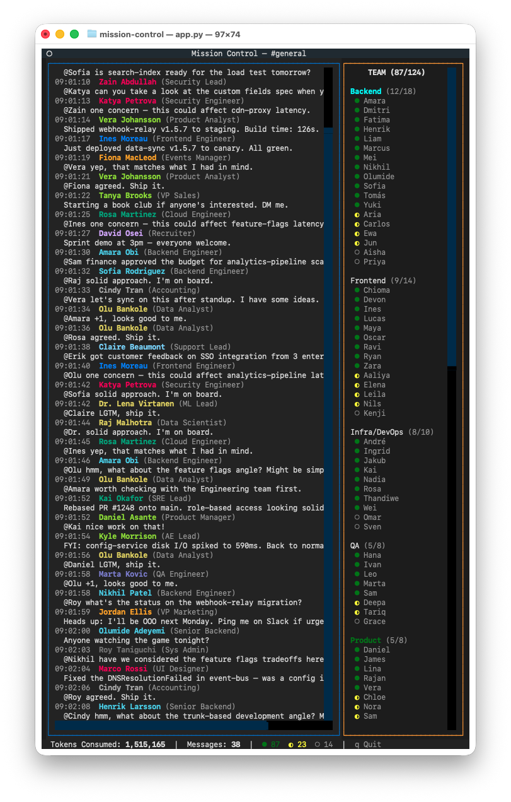

# Mission Control

**124 AI agents running your startup so you don't have to.**

A terminal screensaver that simulates what every founder secretly wishes their Slack looked like: an army of competent AI agents shipping code, closing deals, and debating architecture decisions — all without a single "per my last email."

   



## What Is This

You know that fantasy where you go on vacation and come back and your company is somehow running *better* without you?

This is that. In your terminal.

124 AI agents across 15 departments — Engineering, Product, Design, Sales, Marketing, Finance, Legal, Security, HR, IT, and more — doing their jobs. Deploying services. Reviewing PRs. Debating GraphQL vs REST. Wishing each other happy birthday. The whole startup experience, minus the equity dilution.

**No LLM calls. No API keys. No cloud bills.** Just pure, deterministic fiction running at whatever speed your dopamine receptors require.

## Why

- **For founders:** Open it on your second monitor during investor calls. Instant credibility boost. "As you can see, the team is fully autonomous."
- **For developers:** It's the screensaver you didn't know you needed. Better than fish, worse than actual productivity.
- **For VCs:** Due diligence has never been easier. Look at all those green dots.
- **For recruiters:** Finally, a company where every candidate accepts the offer.

## Features

- 124 named AI agents with distinct personalities, roles, and chattiness levels
- 15 departments with color-coded presence indicators
- Threaded conversations that actually make sense (70% replies, 20% new threads, 10% standalone)
- Realistic pacing with burst messages and quiet periods
- Fictitious token counter that goes up and to the right (as all good metrics should)
- Status cycling — agents go busy, go away, come back (just like real employees)
- Pre-filled chat history so it looks like things were happening before you showed up
- Speed controls: 0.5x for zen mode, 4x for "I have a board meeting in 5 minutes"

## Run

```bash
git clone https://github.com/tawheed/mission-control.git
cd mission-control
./mission-control
```

That's it. The launcher auto-creates a virtualenv and installs dependencies on first run.

## Controls

| Key | Action |
|-----|--------|
| `q` | Quit (but why would you) |

## The Team

Your 124 agents are distributed across:

| Department | Headcount | Vibe |
|-----------|-----------|------|
| Backend Engineering | 18 | Deploying things, arguing about ORMs |
| Frontend Engineering | 14 | CSS wizards, state management debates |
| Infrastructure | 10 | Kubernetes whisperers, scaling pods |
| QA | 8 | Breaking everything (on purpose) |
| Product | 8 | Prioritizing the backlog, forever |
| Design | 7 | Pixel-perfecting, running usability tests |
| Data & ML | 8 | Training models, building pipelines |
| Marketing | 10 | Optimizing funnels, chasing ROAS |
| Sales | 8 | Crushing quota, updating the CRM |
| Support | 8 | Reproducing bugs, writing docs |
| HR & People | 6 | Culture building, hiring |
| Finance & Legal | 6 | Reviewing contracts, closing the books |
| Executive | 5 | Setting vision (in 5 words or fewer) |
| Security | 4 | Saying no to things (important job) |
| IT | 4 | Keeping the lights on |

Every agent has a name, a role, a personality trait, and a chattiness score. Some never shut up. Some only speak when spoken to. Just like your real team.

## FAQ

**Is this actually useful?**
Define useful. It's a screensaver. It makes your terminal look busy. It sparks joy. That's 3 things.

**Does it use real AI?**
No. Zero LLM calls. Zero tokens consumed. Zero API bills. The token counter in the status bar is a lie, but an inspiring one.

**Can I customize the bots?**
It's a single Python file. Go wild. Add your co-founder. Remove HR. Make everyone a 10x engineer. It's your fantasy.

**Why 124 agents?**
Because 100 felt too round and 200 felt excessive. 124 is the number where a VC squints at your org chart and says "that's a real company."

**Can I use this in production?**
It *is* production.

## License

MIT — do whatever you want with it. Add your company name. Put it on a TV in your office. Tell people it's real. We won't judge.

## Credits

Built by [TK](https://tkkader.com) with Claude Code. The entire thing — 124 bots, threaded conversations, the TUI, and this README — was vibe-coded in one session. The future is now.

For actual startup advice (from a human), subscribe to [TK's YouTube channel](https://tkkader.com/youtube).
